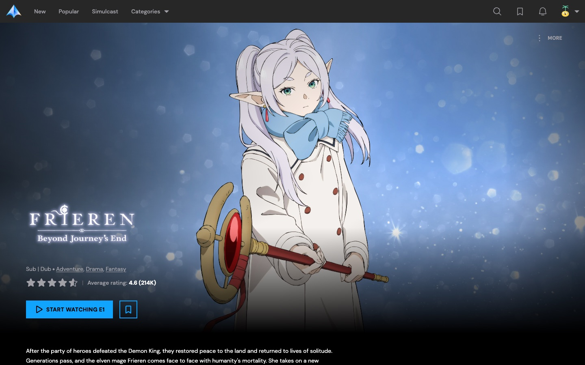
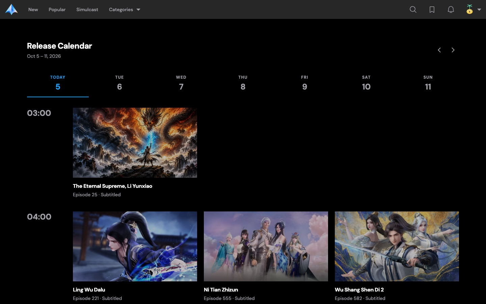
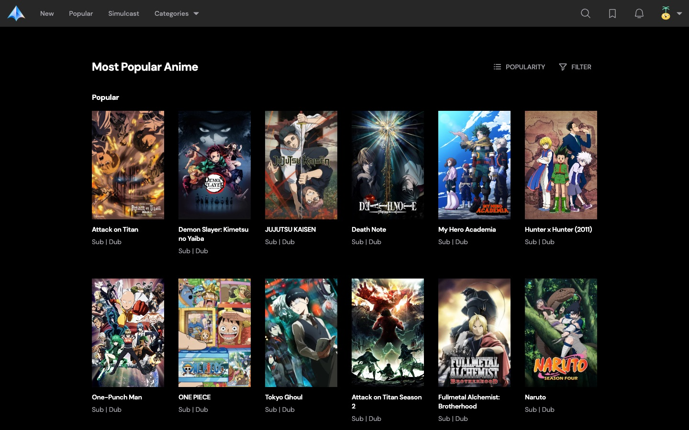
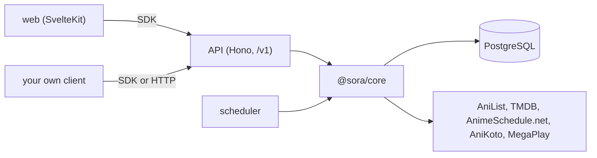

<p align="center">
  
</p>

<h1 align="center">Sora</h1>

<p align="center">A self-hosted anime streaming and tracking app, with a typed HTTP API and SDK underneath.</p>

<p align="center">
  
  
  
  
</p>

<p align="center">
  
</p>

---

## What is Sora?

Sora is an anime app you run yourself. You get a catalogue to browse and search, a player, a watchlist,
Continue Watching, a release calendar, and notifications when a show you follow gets a new episode.
Every account holds any number of profiles, each with its own watchlist and progress.

Under the web app is the part that makes it interesting to build on: a versioned HTTP API, a
background scheduler, and a fully typed TypeScript SDK. The web app is one client of that API. It
doesn't reach around it, so anything else you write gets the same data and the same guarantees.

|                                                                                                                                |                                                                                                |
| ------------------------------------------------------------------------------------------------------------------------------ | ---------------------------------------------------------------------------------------------- |
|  |  |
|                                                  |                                                                                                |

## Features

- **Catalogue and search.** Browse new, popular, and simulcast shows, filter by genre and season,
  and search. Search answers from Sora's own database and never waits on an upstream service.
- **Playback that falls through.** Sora asks AniKoto and MegaPlay for a stream and moves to the next
  one when a source fails. It prefers dub over sub, and a sub always has English, either as a
  subtitle track or burned in. Skip intro and outro segments come with each stream.
- **A stream proxy.** Playlists, segments, and subtitles go through the API behind signed, expiring
  tokens, so the browser never talks to a provider directly.
- **Watchlist, progress, and rewatching.** Per-profile status, resume positions, Continue Watching,
  and a rewatch flow that keeps your original completion. See [`docs/implementations`](docs/implementations).
- **Release calendar and notifications.** The scheduler follows every airing show and lists an
  episode only once a provider carries it. Notifications come from your watchlist and release times.
- **Accounts and profiles.** E-mail and password sign-in, one account, any number of profiles.

## How it fits together



The API and the scheduler are two processes over one codebase, [`@sora/core`](packages/core). Core
owns the database schema, the catalogue, and the playback providers. The API serves what core
stores. The scheduler fills it, under each upstream's rate limit.

## Apps

| App                                 | What it does                                                          |
| ----------------------------------- | --------------------------------------------------------------------- |
| [`@sora/api`](apps/api)             | HTTP API under `/v1`, with an OpenAPI document and `/health`          |
| [`@sora/scheduler`](apps/scheduler) | Follows airing anime and stores new episodes once a provider has them |
| [`web`](apps/web)                   | SvelteKit web app                                                     |

## Packages

| Package                           | What it does                                                 |
| --------------------------------- | ------------------------------------------------------------ |
| [`@sora/core`](packages/core)     | Catalog, playback providers, database schema, and migrations |
| [`@sora/sdk`](packages/sdk)       | Typed client for the API                                     |
| [`@sora/shared`](packages/shared) | Small helpers used across the workspaces                     |

## The SDK

The SDK has no list of endpoint methods to keep in sync. It takes a route from the API's own
contract and derives everything else from it.

```ts
import { route, SoraClient } from "@sora/sdk";

const sora = new SoraClient({
	baseUrl: "http://localhost:3000",
});

const [result] = await sora.request(route.searchSeries, {
	query: {
		q: "Frieren",
	},
});

const episodes = await sora.request(route.listEpisodes, {
	params: {
		series_id: result.id,
	},
});

const media = await sora.request(route.getPlayback, {
	params: {
		series_id: result.id,
		episode: episodes[0].number,
	},
});
```

- **Input is typed from the route.** `params`, `query`, and `body` exist only when the route has
  them, and are required only when something in them is required. Leaving out `series_id` fails
  type-checking.
- **Output is typed from the route.** `request` resolves to the response's `results`. Use
  `requestWithMeta` when you also want `meta`, such as the pagination links.
- **Responses are checked at runtime.** Each one is parsed with the route's Zod schema, so a
  provider-side surprise surfaces as an error at the boundary and not three calls later.
- **One definition.** Request and response shapes are Zod schemas in the API's contract. The server
  validates with them, the OpenAPI document is generated from them, and the SDK imports them. A
  change that breaks a client fails type-checking in this repo before it ships.
- **One error type.** A failed request throws `SoraError`, which carries the HTTP status and the
  API's error code.

The OpenAPI document is served at [`/v1/openapi.json`](http://localhost:3000/v1/openapi.json) while
the API runs, if you would rather generate a client in another language.

## Getting started

Requires [Bun](https://bun.com) 1.4+ and Docker. You also need a free
[TMDB](https://www.themoviedb.org/settings/api) read access token and an
[AnimeSchedule.net](https://animeschedule.net) API key.

```sh
bun install
cp packages/core/.env.example packages/core/.env  # then fill in the secrets
cp apps/web/.env.example apps/web/.env

bun run dev    # PostgreSQL, migrations, API on :3000, and web on :5173
```

Sign-up is turned off, so create your account from the command line. It asks for the password, so
the password stays out of your shell history.

```sh
cd packages/core
bun run auth:create-account you@example.com "Your name"
```

Then open <http://localhost:5173> and sign in. The catalogue fills as the scheduler runs. It follows
upstream providers under their rate limits, so `dev` leaves it out. Start it on its own with
`bun run --filter @sora/scheduler start`.

These commands run through [Turborepo](https://turborepo.dev), configured in `turbo.json`.

## Testing

Tests use Bun's built-in runner and sit next to the code they cover, as `name.test.ts` beside
`name.ts`. A test lives one import away from what it checks, moves with the file when you rename
it, and a package never needs a second tree to mirror its first.

```sh
bun run test          # every workspace, through Turborepo
bun run check         # type-check every workspace
bun run lint          # oxlint
bun run format:check  # oxfmt
```

About 350 tests cover the parts that break quietly: matching a show to a provider's catalogue,
picking and falling through streams, signing and verifying proxy tokens, the AniList request queue
and its rate limits, the scheduler's airing plan, watchlist status, and the SDK's types and error
handling.

Run `bun run test` from the repo root. A bare `bun test` at the root doesn't use each package's own
test script and fails.

## Project layout

```
apps/
  api/         Hono routes, the OpenAPI document, the contract the SDK reads
  scheduler/   the long-running worker
  web/         SvelteKit, with routes grouped as (app), (auth), and api
packages/
  core/        database schema, migrations, catalogue, playback, scheduler jobs
  sdk/         the typed client
  shared/      helpers used by more than one workspace
docs/          design notes for features that need more than a commit message
```

## Credits

Sora doesn't make its own anime data or host any video.

- [AniList](https://anilist.co): titles, descriptions, genres, cover art, scores,
  how entries relate, and airing schedules.
- [The Movie Database (TMDB)](https://www.themoviedb.org): episode details,
  backdrops, and logos. This product uses the TMDB API but is not
  endorsed or certified by TMDB.
- [AnimeSchedule.net](https://animeschedule.net): when English dubs come out.
