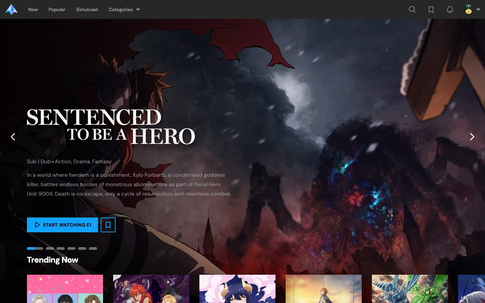
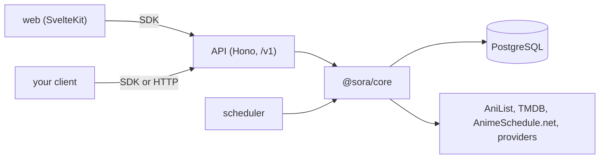

<p align="center">
  
</p>

<h1 align="center">Sora</h1>

<p align="center">Anime streaming you host yourself, built on an API you can build on.</p>

<p align="center">
  
  
  
  
</p>

<p align="center">
  
</p>

Sora is a catalogue, player, watchlist, and release calendar for anime, run from your own server.
Accounts hold any number of profiles, and each profile keeps its own watchlist, progress, and
notifications.

The web app is one client of a versioned HTTP API. A scheduler keeps the catalogue current, and a
typed SDK gives your own code the same access the web app has.

- Playback tries AniKoto and MegaPlay in turn and falls through when a source fails. Streams go
  through a signed proxy, and skip-intro segments come with them.
- A show is listed once a provider actually carries its episode, and the calendar follows airing
  times.
- Search and browsing read from Sora's own database and never wait on an upstream service.

## The SDK

Routes come from the API's own contract, so the client has no endpoint methods to keep in sync.
Inputs and outputs are typed from the route, and every response is parsed at runtime.

```ts
import { route, SoraClient } from "@sora/sdk";

const sora = new SoraClient({
	baseUrl: "http://localhost:3000",
});

const [result] = await sora.request(route.searchSeries, {
	query: {
		q: "Frieren",
	},
});

const episodes = await sora.request(route.listEpisodes, {
	params: {
		series_id: result.id,
	},
});
```

Leave out `series_id` and it fails type-checking. The same Zod schemas validate requests on the
server, generate the OpenAPI document at `/v1/openapi.json`, and type the SDK, so a breaking change
fails here before it ships.

## Architecture



| Workspace                           | Role                                                               |
| ----------------------------------- | ------------------------------------------------------------------ |
| [`@sora/api`](apps/api)             | HTTP API and OpenAPI document                                      |
| [`@sora/scheduler`](apps/scheduler) | Follows airing anime and stores new episodes under upstream limits |
| [`web`](apps/web)                   | SvelteKit app                                                      |
| [`@sora/core`](packages/core)       | Database schema, catalogue, playback providers, scheduler jobs     |
| [`@sora/sdk`](packages/sdk)         | Typed client                                                       |
| [`@sora/shared`](packages/shared)   | Helpers shared across workspaces                                   |

## Getting started

Requires [Bun](https://bun.com) 1.4+, Docker, a [TMDB](https://www.themoviedb.org/settings/api)
read access token, and an [AnimeSchedule.net](https://animeschedule.net) API key.

```sh
bun install
cp packages/core/.env.example packages/core/.env  # fill in the secrets
cp apps/web/.env.example apps/web/.env

bun run dev  # PostgreSQL, migrations, API on :3000, web on :5173
```

Sign-up is off. Create your account from the terminal, which prompts for the password:

```sh
cd packages/core && bun run auth:create-account you@example.com "Your name"
```

Then sign in at <http://localhost:5173>. The scheduler stays out of `dev` because it polls
upstream providers; start it with `bun run --filter @sora/scheduler start`.

## Testing

Tests run on Bun's runner and sit beside the code they cover, as `name.test.ts` next to `name.ts`.

```sh
bun run test    # all workspaces
bun run check   # type-check
bun run lint
```

## Credits

Sora makes no anime data and hosts no video.

- [AniList](https://anilist.co) for titles, art, scores, relations, and airing schedules.
- [TMDB](https://www.themoviedb.org) for episode details, backdrops, and logos. This product uses
  the TMDB API but is not endorsed or certified by TMDB.
- [AnimeSchedule.net](https://animeschedule.net) for English dub release times.
