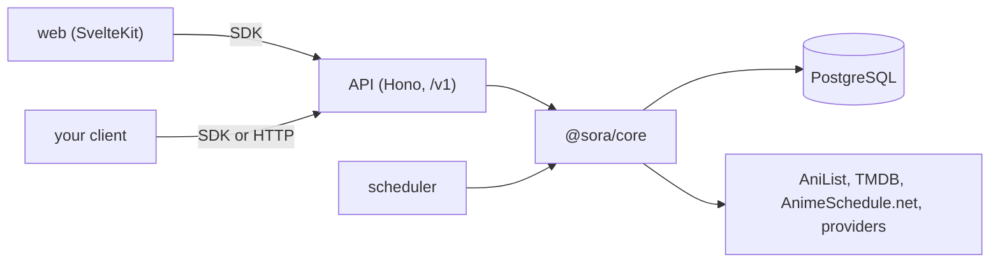

<p align="center">
  
</p>

<h1 align="center">Sora</h1>

<p align="center">Anime streaming you host yourself, built on an API you can build on.</p>

<p align="center">
  
  
  
  
</p>

Sora is a catalogue, player, watchlist, and release calendar for anime, run from your own server.
Accounts hold any number of profiles, and each profile keeps its own watchlist, progress, and
notifications.

The web app is one client of a versioned HTTP API. A scheduler keeps the catalogue current, and a
typed SDK, checked against the API's own route definitions, gives your own code the same access the
web app has.

- Playback tries AniKoto and MegaPlay in turn and falls through when a source fails. Streams go
  through a signed proxy, and skip-intro segments come with them.
- A show is listed once a provider actually carries its episode, and the calendar follows airing
  times.
- Search and browsing read from Sora's own database and never wait on an upstream service.

## Architecture



| Workspace                           | Role                                                               |
| ----------------------------------- | ------------------------------------------------------------------ |
| [`@sora/api`](apps/api)             | HTTP API and OpenAPI document                                      |
| [`@sora/scheduler`](apps/scheduler) | Follows airing anime and stores new episodes under upstream limits |
| [`@sora/web`](apps/web)             | SvelteKit app                                                      |
| [`@sora/core`](packages/core)       | Database schema, catalogue, playback providers, scheduler jobs     |
| [`@sora/sdk`](packages/sdk)         | Typed client                                                       |
| [`@sora/shared`](packages/shared)   | Helpers shared across workspaces                                   |

## Getting started

Requires [Bun](https://bun.com) 1.4.2+, Docker with Compose and a running Docker engine,
a [TMDB](https://www.themoviedb.org/settings/api) API Read Access Token,
and an [AnimeSchedule.net](https://animeschedule.net) application token.
Both tokens are required by the current configuration.

```sh
git clone https://github.com/mkelvers/sora.git
cd sora
bun install
cp packages/core/.env.example packages/core/.env
cp apps/web/.env.example apps/web/.env
```

Edit `packages/core/.env` before starting:

- Leave `DATABASE_URL` as provided for the included local database.
- Run `openssl rand -base64 48` three times. Use a different result for each of
  `STREAM_SIGNING_SECRET`, `WEB_CLIENT_KEY`, and `AUTH_SECRET`.
- Fill in `TMDB_READ_ACCESS_TOKEN` with TMDB's **API Read Access Token**, not its API key.
- Fill in `ANIME_SCHEDULE_API_KEY` with your AnimeSchedule application token.

In `apps/web/.env`, copy the same `WEB_CLIENT_KEY` from `packages/core/.env`.
Leave `SORA_API_URL` as provided for local development. Each example includes comments about
where to get values and which settings are optional. Credentials belong in the ignored `.env`
files; the examples contain local defaults and blank secret fields.

The API and scheduler load `packages/core/.env` directly, so they need no separate env files.

```sh
bun run dev
```

This starts PostgreSQL, applies migrations, and runs the API on :3000, the web app on :5173,
and the scheduler. Keep it running and open a second terminal to create an account.

Sign-up is off. The account command requires an interactive terminal and hides the password
while you type. Enter at least eight characters and press Enter, or press Ctrl+C to cancel:

```sh
cd sora/packages/core # from the directory where you cloned Sora
bun run auth:create-account you@example.com "Your name"
```

Then sign in at <http://localhost:5173>.

The database starts empty. The scheduler fills the catalogue in the background; a running
web app does not mean the initial catalogue sync has finished.

If setup fails:

- Check `docker info` if Docker cannot connect to its engine.
- PostgreSQL uses port 5432. If it is occupied, change the host port in `compose.yaml` and
  the port in `DATABASE_URL` together. Use a separate Compose project name if another Sora
  checkout is already running, so the two checkouts do not share a database.
- For a different API port, set `PORT` and `AUTH_URL` in `packages/core/.env`, then update
  `SORA_API_URL` in `apps/web/.env` to match.
- A startup validation error naming an env key means its value is missing or invalid.
  Check the comments in the corresponding `.env.example`.

## Production deployment

The root `Dockerfile` has three build targets: `web`, `api`, and `scheduler`.
Configure three Dokploy applications from this repository, using the root build context
and the matching target. All services use Bun 1.4.2. The web and API listen on port 3000.
The API applies database migrations before starting; deploy it before the scheduler.

Use PostgreSQL 18 with an explicit persistent volume mounted at `/var/lib/postgresql`.
Keep its port internal to the Docker network. Set the API and scheduler environment
from `packages/core/.env.example`, with `HOST=0.0.0.0`, the production database URL,
and the public HTTPS origin in `AUTH_URL` and `AUTH_TRUSTED_ORIGINS`.
Include the internal API origin in `AUTH_TRUSTED_ORIGINS` too, since the web
server signs in through that address.
For the web app, set `SORA_API_URL` to the internal API service URL, copy the same
`WEB_CLIENT_KEY`, and set `ORIGIN` to the public HTTPS origin.
Behind Cloudflare Tunnel, set `ADDRESS_HEADER=cf-connecting-ip` on the web service
so sign-in limits use each visitor's address.

Route `/` to the web service and `/v1` to the API on the same domain. Keep TLS at
your reverse proxy or tunnel. `/v1` requires authentication; the API's internal
`/health` endpoint is used by its Docker health check. The scheduler's cron jobs
and queue are stored in PostgreSQL, so they need no separate Dokploy schedules.

## Testing

Tests run on Bun's runner and sit beside the code they cover, as `name.test.ts` next to `name.ts`.

```sh
bun run test    # all workspaces
bun run check   # type-check
bun run lint
```

## Credits

Sora makes no anime data and hosts no video.

- [AniList](https://anilist.co) for titles, art, scores, relations, and airing schedules.
- [TMDB](https://www.themoviedb.org) for episode details, backdrops, and logos. This product uses
  the TMDB API but is not endorsed or certified by TMDB.
- [AnimeSchedule.net](https://animeschedule.net) for English dub release times.
